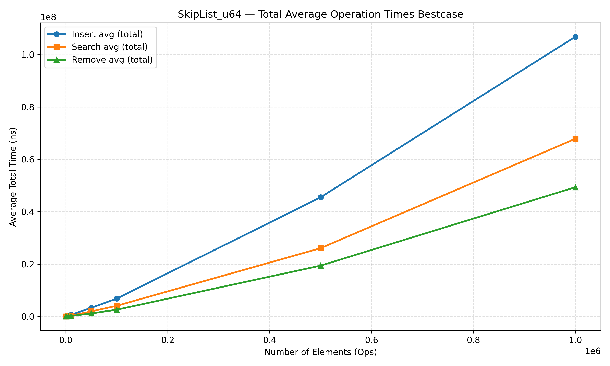
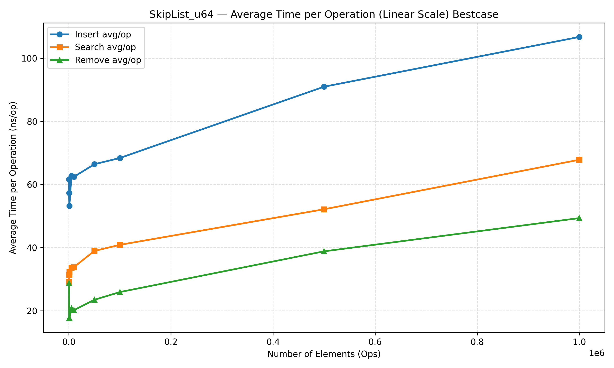

# SkipList
## A no-dependency SkipList / Map implementation for C99 and C11

## Highlights
* Supports all major C numeric types: int32_t, int64_t, uint32_t, and uint64_t
* Macro generator for user-defined key/value types with optional cleanup hooks
* Zero resource leaks
* Comprehensive unit tests and benchmark utilities
* Optional C11 _Generic interface for ease of use
* CMake build system
* FOSS, licensed under LGPL-3.0

## Performance 
Performance of the library has been tested in two ways. 
1. **Realistic random workloads** — randomized insertion, search, and deletion, provided by the [benchmark program](test/main.c). 
2. **Best-case scenarios** — head insertion/removal and sequential search

All timings are in ns.
### Realistic test results


### Best case test results





## List interface
ipLists represent ordered sets — no duplicate keys are allowed.
Each typed variant (`i32`, `u32`, `i64`, `u64`) exposes identical APIs differing only by type. \
### Example (i32)
```c
SkipList_i32* skipList_i32_create(void);
bool     skipList_i32_insert (SkipList_i32 *list, int32_t id);
void     skipList_i32_remove (SkipList_i32 *list, int32_t id);
bool     skipList_i32_search (SkipList_i32 *list, int32_t search_id);
uint32_t skipList_i32_getSize(const SkipList_i32 *list);
bool     skipList_i32_isEmpty(const SkipList_i32 *list);
void     skipList_i32_destroy(SkipList_i32 **list);
void     skipList_i32_print  (SkipList_i32 *list);
```
### Notes
* Insertion and search are O(log(n)) expected on average
* Duplicate insertions will return `false`
* `destroy()` will internally release all internal nodes, freeing and destroying the list, and will set the user provided pointer to null preventing use after free.
* `print()` provided debug util for visualizing the list at its current state 

**Equivalent** APIs exist for:
* `SkipList_u32`, `SkipList_i64`, and `SkipList_u64`
### Example usage
```c
SkipList_u64 *list = skipList_u64_create();
skipList_u64_insert(list, 42);
bool found = skipList_u64_search(list, 42);
skipList_u64_destroy(&list);
```
## Map interface
**SkipMaps** extend SkipLists by storing key–value pairs, maintaining sorted order by key.
## Example (i32)
```c
SkipMap_i32* skipMap_i32_create(void);
bool   skipMap_i32_put     (SkipMap_i32 *sm, int32_t id, void *data);
void*  skipMap_i32_get     (SkipMap_i32 *sm, int32_t id);
void*  skipMap_i32_remove  (SkipMap_i32 *sm, int32_t id);
bool   skipMap_i32_contains(SkipMap_i32 *sm, int32_t id);
void   skipMap_i32_destroy (SkipMap_i32 **sm);
void   skipMap_i32_print   (SkipMap_i32 *sm);
```
### Notes
* Keys are stored in sorted ascending order
* Duplicate insertions will update existing entry ( **note** for **pointer** types this is not recommend as the pointer will **leak**)
* `remove()` returns the associated data pointer for user cleanup
* `destroy()` free all nodes and calls free on associated value type (note do not call this if the values in the map are not heap allocation)  

**Equivalent** APIs exist for:
* `SkipMap_u32`, `SkipMap_i64`, and `SkipMap_u64`

### Example 
```c
SkipMap_u64 *map = skipMap_u64_create();
skipMap_u64_put(map, 1001, some_ptr);
void *value = skipMap_u64_get(map, 1001);
skipMap_u64_destroy(&map);
```
## C11 Generics
When compiled with C11 or newer, a unified `_Generic` wrapper provides automatic type dispatching at compile time.

### Example
```c
#include<skiplist.h>

int main(){
    auto list_i = skipList_create((int32_t)0);
    auto list_u = skipList_create((uint64_t)0);
    skipList_insert(list_i, 42);
    skipList_insert(list_u, 999);

    if (skipList_search(list_i, 42))
        printf("Found 42!\n");

    skipList_destroy(&list_i);
    skipList_destroy(&list_u);
}
```
This resolves to the correct typed functions (e.g. `skipList_i32_insert`, `skipList_u64_insert`) at **compile** time, with no runtime overhead.


## Provided Generics Macro for user defined data types and keys

### Example Generic Macro For List type

```c

// ================================
// Complex key type: 2D coordinate
// ================================
typedef struct {
    int x;
    int y;
} Point;

#define CMP_POINT_XY(a, b) ({                     \
    const Point *pa__ = (const Point*)(a);        \
    const Point *pb__ = (const Point*)(b);        \
    int dx__ = (pa__->x > pb__->x) - (pa__->x < pb__->x); \
    dx__ != 0 ? dx__ :                            \
    ( (pa__->y > pb__->y) - (pa__->y < pb__->y) );\
})

static inline void free_point(Point * ptr){
    if(!ptr)return;
    printf("freeing point (%d,%d)\n", ptr->x,ptr->y);
    free(ptr);
}

DEFINE_GENERIC_SKIPLIST(SL_Point, Point*, CMP_POINT_XY, free_point)

....

// Sentinel (unused but required)
Point *sentinel = malloc(sizeof(Point));
sentinel->x = 0;
sentinel->y = 0;

// Create skiplist
SkipList_SL_Point *sl = SkipList_SL_Point_create(sentinel);
Point *p = malloc(sizeof(Point));
p->x = 1;
p->y = 2;
bool inserted = SkipList_SL_Point_insert(sl, p);
....
SkipList_SL_Point_destroy(&sl);
```

| Parameter        | Description                           |
| ---------------- | ------------------------------------- |
| `NAME`           | Suffix for type names                 |
| `KEY_TYPE`       | Type of the key                       |
| `COMP_FUNC`      | Comparison function used for ordering |
| `ON_REMOVE_KEY`  | Optional cleanup for key              |


### Example Generic Macro For Map type


```c
// ====== Complex Data Example ======
typedef struct {
    double radius;
    char *label; // dynamically allocated label to test cleanup
} Circle;

// Comparison by radius (ascending)
#define CIRCLE_CMP(a,b) (((a).radius > (b).radius) - ((a).radius < (b).radius))

// On remove: free the label
static inline void free_circle_data(Circle c) {
    printf("cleaning up circle %s\n",c.label);
    if (c.label) {
        free(c.label);
        c.label = NULL;
    }
}

static inline void notify_key_remove_func(Circle c){
    printf("circle with radius key %lf is being removed\n",c.radius);
}

// Instantiate a generic SkipMap for Circle keys and Circle data
DEFINE_GENERIC_SKIPMAP(SM_Circle, Circle, Circle, CIRCLE_CMP, notify_key_remove_func, free_circle_data)

...

// Create map with sentinel key and value
Circle sentinel = { .radius = 0.0, .label = NULL };
SkipMap_SM_Circle *sm = SkipMap_SM_Circle_create(sentinel, sentinel);
Circle key = { .radius = 1.0, .label = NULL };
Circle data = {
    .radius = 1.0,
    .label = malloc(32)
};
snprintf(data.label, 32, "Circle_%d", i + 1);
SkipMap_SM_Circle_put(sm, key, data)

...

SkipMap_SM_Circle_Remove(&((Circle){.radius = 1.0, .label = NULL}))
```
| Parameter        | Description                           |
| ---------------- | ------------------------------------- |
| `NAME`           | Suffix for type names                 |
| `KEY_TYPE`       | Type of the key                       |
| `DATA_TYPE`      | Type of the stored data               |
| `COMP_FUNC`      | Comparison function used for ordering |
| `ON_REMOVE_KEY`  | Optional cleanup for key              |
| `ON_REMOVE_DATA` | Optional cleanup for data             |


## License
This project is licensed under the GNU Lesser General Public License v3.0 (LGPL-3.0-only).
You are free to use, modify, and redistribute under the terms of the license.
See LICENSE for full details.